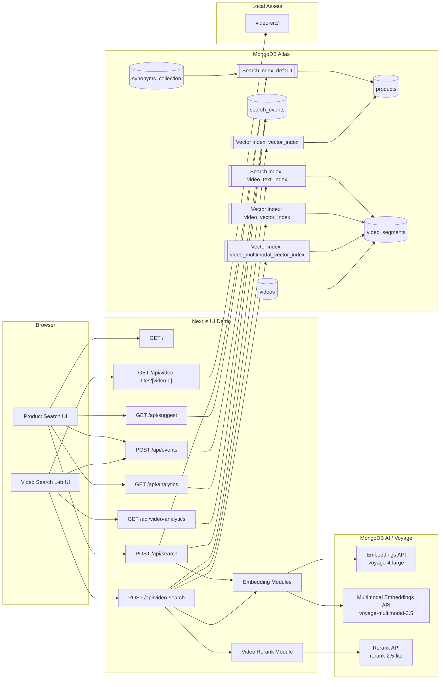
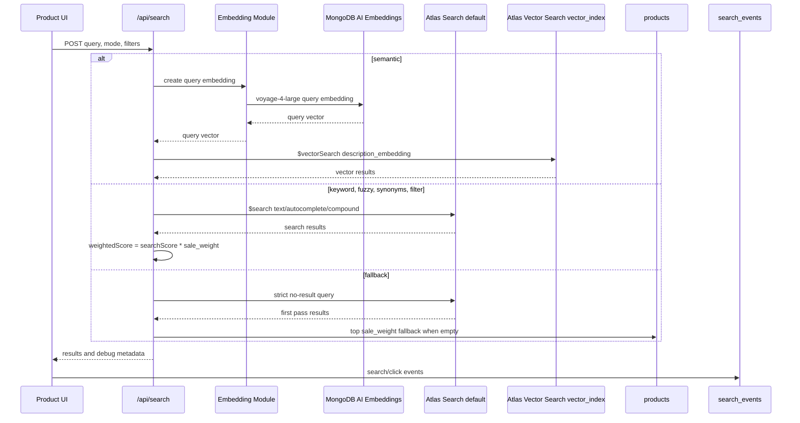
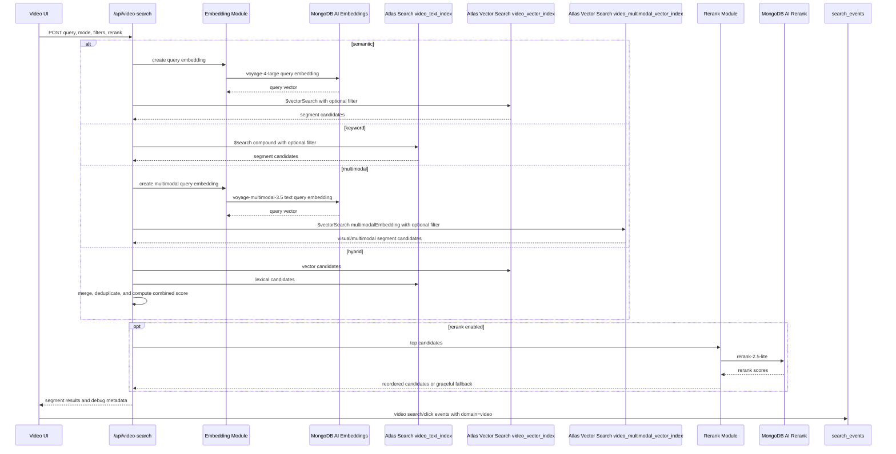

# Architecture

## Scope

This project demonstrates two connected search scenarios on MongoDB Atlas:

- Product discovery with Atlas Search and Atlas Vector Search.
- Video segment search with text search, vector search, hybrid retrieval, optional reranking, playback, and analytics.

## End-to-End Architecture

## Product Search Flow

## Video Search Flow

## Data Model Summary

| Collection | Key Fields | Notes |
|---|---|---|
| `products` | `id`, `name`, `description`, `category`, `tags`, `sale_weight`, `description_embedding` | One product document powers text search, vector search, filters, and business ranking. |
| `synonyms_collection` | `mappingType`, `synonyms` | Source collection for product synonym mapping. |
| `videos` | `videoId`, `title`, `sourceUrl`, `durationSec`, `tags` | Video-level metadata. |
| `video_segments` | `videoId`, `segmentId`, `startSec`, `endSec`, `title`, `description`, `transcript`, `tags`, `embedding`, `multimodalEmbedding` | Segment-level retrieval unit for precise timestamp search. |
| `search_events` | `type`, `domain`, `query`, `productId`, `videoId`, `segmentId`, `createdAt` | Shared analytics event collection for product and video search. |

## AI Services

| Service | Endpoint | Usage |
|---|---|---|
| Embeddings | `https://ai.mongodb.com/v1/embeddings` | Product and video query/document embeddings with `voyage-4-large`. |
| Multimodal Embeddings | `https://ai.mongodb.com/v1/multimodalembeddings` | Video segment clip embeddings and multimodal query embeddings with `voyage-multimodal-3.5`. |
| Rerank | `https://ai.mongodb.com/v1/rerank` | Optional video candidate reranking with `rerank-2.5-lite`. |

## Security Notes

- `MONGODB_URI` and `VOYAGE_API_KEY` must stay in `.env.local` or shell environment variables.
- The browser should never receive raw embeddings, connection strings, or API keys.
- `/api/events` and video analytics are suitable for local or controlled demos; add authentication and rate limiting before public deployment.
